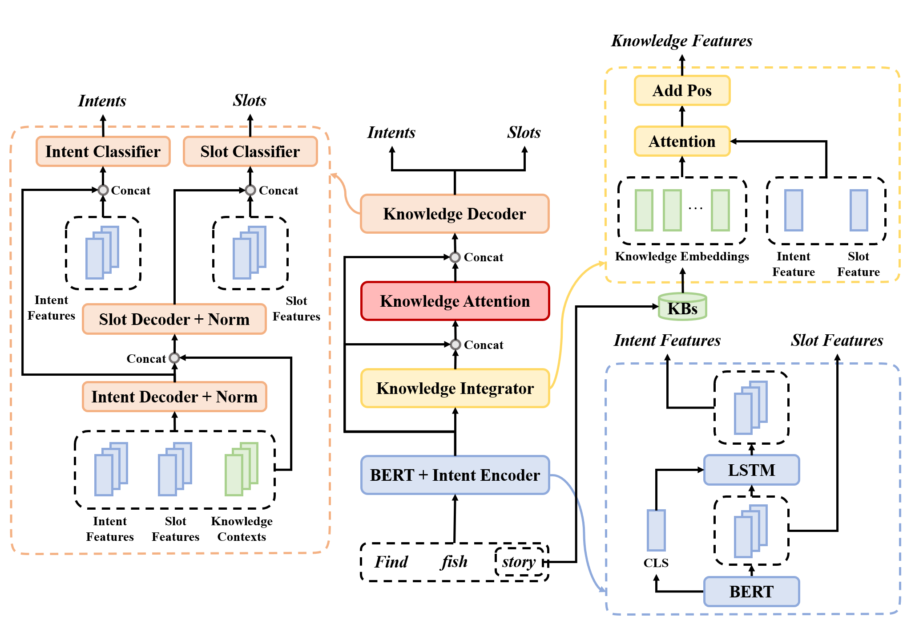

# BERT-With-KnowledgeBase

## Model

- Overall
<p float="left" align="center">
    
</p>

- BERT + Intent Decoder
<p float="left" align="center">
    
</p>

## Dependencies

- python>=3.5
- torch==1.4.0
- transformers==2.7.0
- seqeval==0.0.12

## Dataset

|       | Train  | Dev | Test | Intent Labels | Slot Labels |
| ----- | ------ | --- | ---- | ------------- | ----------- |
| ATIS  | 4,478  | 500 | 893  | 21            | 120         |
| Snips | 13,084 | 700 | 700  | 7             | 72          |

- The number of labels are based on the _train_ dataset.
- Add `UNK` for labels. (For intent and slot labels which are only shown in _dev_ and _test_ dataset)
- Add `PAD` for slot label.

## How to run

##### Download 'bert-base-uncased' model (unzip it) and vocab file to `./bert`: 
- https://s3.amazonaws.com/models.huggingface.co/bert/bert-base-uncased.tar.gz
- https://s3.amazonaws.com/models.huggingface.co/bert/bert-base-uncased-vocab.txt

##### You can reproduce my experimental results by using the following parameters:
```
# For ATIS
$ python main.py --task atis --pos --c_dr 0.2 --num_epochs 40

# For Snips
$ python main.py --task snips --pos --schedule cosine --batch_size 64 --num_epochs 80
```

## Results

- Evaluated model every 5/10 epochs on ATIS/Snips dataset.
- Selected hyper-parameters on dev set and evaluated model on test set.
- Only tested with `uncased` model.

|           |                  | Intent acc (%) | Slot F1 (%) | Sentence acc (%) |
| --------- | ---------------- | -------------- | ----------- | ---------------- |
| **ATIS**  | **Our model**    | **97.9**       | 96.1        | **89.1**         |
|           | BERT             | 97.5           | 96.1        | 88.2             |
|           | BERT+StackProp   | 97.5           | 96.1        | 88.6             |
| **Snips** | **Our model**    | 98.9           | **97.2**    | **93.3**         |
|           | BERT             | 98.6           | 97.0        | 92.8             |
|           | BERT+StackProp   | **99.0**       | 97.0        | 92.9             |

## References

- [JointBERT](https://github.com/monologg/JointBERT)
- [Huggingface Transformers](https://github.com/huggingface/transformers)
